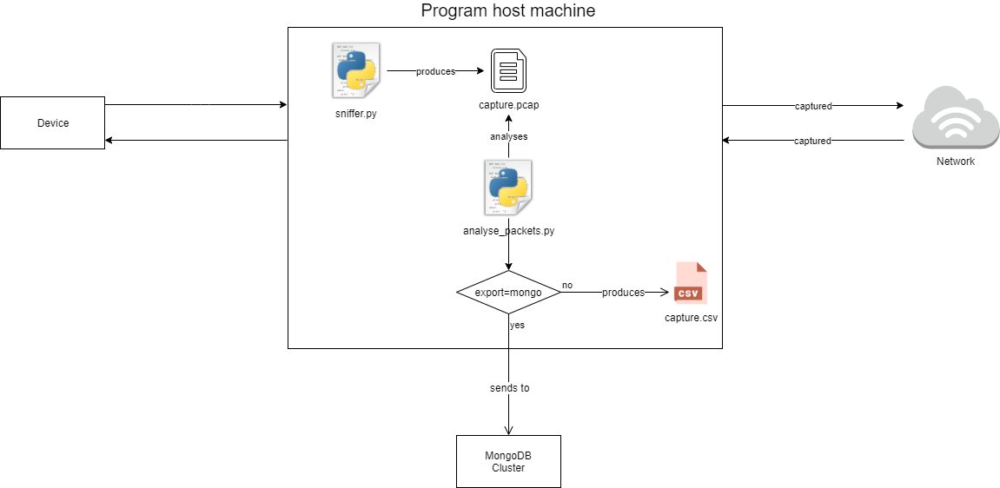

# Capitrain

## Table of Contents

*	[Installation](#installation)
* [Usage](#usage)
* [Environment variables](#environment-variables)
*	[Context and problem to solve](#context-and-problem-to-solve)
*	[Explored possibilities and solution provided](#explored-possibilities-and-solution-provided)
*	[Results](#results)

## Installation

* TShark installed
* Python 3 installed
* Run `pip3 install -r requirements.txt`

## Usage

To sniff data: 
 * Add in the .env file the [variables for the sniffer](#sniffer)
 * Run `python3 sniffer.py`, you can also provide different options, run `python3 sniffer.py -h` to see them
 * By default the program will generate a `capture.pcap` file in the root folder

To analyse sniffed data:
  * Run `python3 analyse_packets.py`, you can also provide different options, run `python3 analyse_packets.py -h` to see them
  * If you choose the "mongo" export mode, you need complete the [variables about mongoDB](#mongodb) in the .env file
  * By default the program will generate a `results.csv` file in the root folder

### Schema

## Environment variables

### Sniffer

These variables are used for sniffing

* INTERFACE : name of the network interface to listen
* LISTENED_IP : script will capture packets from conversation between LISTENED_IP and other addresses
* LOCAL_IP : IP of the program host machine
* LISTENED_IPV6 (optional) : script will capture packets from conversation between LISTENED_IPV6 and other addresses
* LOCAL_IPV6 (optional) : IPv6 of the program host machine

LISTENED_IP (or LISTENED_IPV6) and LOCAL_IP (or LOCAL_IPV6) can be the same if program host machine and device are the same.

### MongoDB

These variables are only used for analysing in "mongo" export mode

* MONGO_CLUSTER_ADDRESS
* MONGO_DB_NAME
* MONGO_DB_USER
* MONGO_DB_PASSWORD

## Context and problem to solve

The number, type and size of objects we exchange via the Internet have continued to evolve since the 2000s. We share on a daily basis and without realizing it a multitude of complex objects and in large numbers. Network players have predicted an explosion of these and alerted to the need for early implementation of new mechanisms capable of meeting this growing demand.

Several systems to improve the sharing and exchange of data are being studied. Unfortunately, the experimental validation is achieved by using arbitrary models based on projections hypothetical of what data exchanges are and could be.

There is currently no tool available to extract in an agnostic way a model of the objects exchanged for all the applications that we can use on a daily basis.

The objective is to design and develop a tool to collect and analyse information on any type of data transfer to and from a client workstation.

## Explored possibilities and solution provided

### 1 - MITM attack with a Proxy

The fist solution we came up with was to do a man in the middle attack thanks to a proxy. 
For that we configured a proxy with [Burp proxy](https://portswigger.net/burp/documentation/desktop/tools/proxy) and [MITM proxy](https://mitmproxy.org/) (to test different proxies)

With this solution it is easy to see all the request and their payload in http and https in a web browser but for mobile apps it is far more difficult. For few of them it will works but nowadays more and more apps have a SSL Certificate pinning security, it means the app will compare the public key of the server's certificate with a pinned public key the in the apk. If they are not the same the connection will be refused. Because the certificate public key from our proxy will never will never match the pinned key in the app, no connection can be established and we cannot see any data.

**How can we bypass this security?**

We will focus this explanation on Android as we did not test it for iOS.

There are several tools that promise to bypass the SSL Certificate Pinning, we tested [Frida](https://github.com/frida) and [Objection](https://github.com/sensepost/objection) (which is based on Frida). These tools can work but the issue is that most of the apps that we use use on a daily basis are doing code obfuscation and Frida is looking for some keywords in the code to woks properly. In a nutshell these tools are obselete for this purpose.

**Is there any other solution?**

Yes, but you need to be really motivated and it might stil not works. What you can do is to decompile the apk (with frida-tools) and search for lines in the obfuscaded code that seems to be related to the certificate and change them to always return true. As you can guess, famous apps are doing a hard work to prevent you to do these kind of hacky manipulation.

At this point we decided to stop investigating in this solution and to start working on another one.

Work based on:

**Articles on proxy:**
  * https://www.nextinpact.com/news/106364-avec-pirogue-capturer-trafic-https-dun-smartphone-devient-plus-simple.htm
  * https://www.intellectsoft.net/blog/monitor-mobile-app-traffic-with-sniffers/
  * https://null-byte.wonderhowto.com/how-to/use-charles-proxy-view-data-your-mobile-apps-send-receive-0185364/

**Articles on SSL Certificate Pinning**
  * https://v0x.nl/articles/bypass-ssl-pinning-android/
  * https://ninadmathpati.com/all-about-ssl-pinning-bypass/
  * https://github.com/nabla-c0d3/ssl-kill-switch2
  * https://medium.com/bugbountywriteup/how-to-bypass-certificate-validation-ssl-pinning-ef8af8b15c40

### 2 - Network sniffer with a TShark wrapper

The second solution, and the one that is provided in this project is to use TShark.

"TShark is a terminal oriented version of Wireshark designed for capturing and displaying packets when an interactive user interface isn’t necessary or available" ([from wireshark documentation](https://www.wireshark.org/docs/wsug_html_chunked/AppToolstshark.html))

With this solution we cannot see all the request and their paylods as it would be possible with the proxy solution but we have all the packets in TCP/UDP and the minimum information that we need to analyse them.

//TODO: add more info

**Work based on:**
  * https://www.geeek.org/iphone-analyse-trafic-reseau-application-mobile-ios-177/
  * https://ask.wireshark.org/question/7432/how-to-find-size-of-file-downloaded/

**Librairies used in the project:**
  * https://pypi.org/project/pyshark/
  * https://pypi.org/project/pymongo/
  * https://pypi.org/project/dnspython/
  * https://pypi.org/project/python-dotenv/

## Results

MongoDB database dump and CSV files of our results are available in the [results folder](results/), these results are based on multiples .pcap files which are the files generated by [pyshark](https://github.com/KimiNewt/pyshark). These files are available in the [captures folder](results/captures) and contains all the packets we received during sniffing. You can find charts based on our results in the [charts folder](results/charts).
